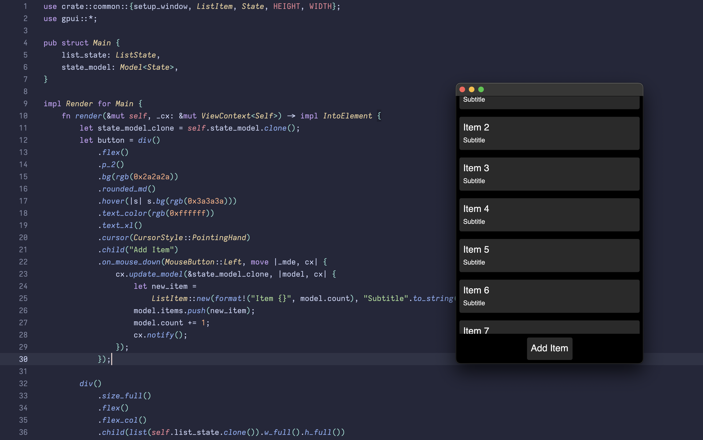

### GPUI List examples

Comment in/out the examples you want to run in [main.rs](./src/main.rs).

Right now there are two examples.

The first is a [simple_list](./src/simple_list.rs) which has the model and list in one view.

The [global_list](./src/global_list.rs) leverages a model in the global context. Nested views can make updates by emitting events.

I put the common `ListItem` component in [common.rs](./src/common.rs)

